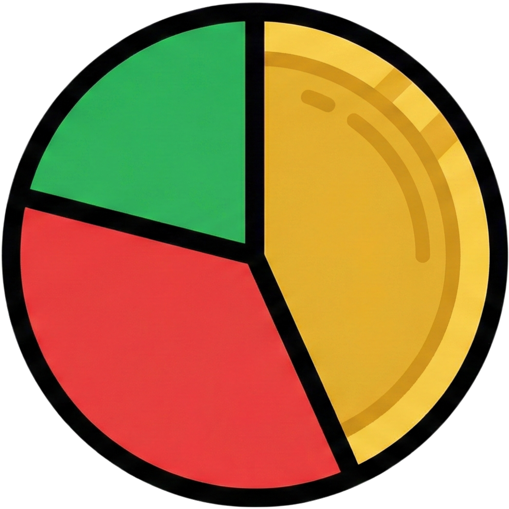

<div align="center">

  

  # 💸 JajanMulu

  **Catatan Keuangan Harian untukmu yang JajanMulu**

  [](https://flutter.dev/)
  [](https://dart.dev/)
  [](https://opensource.org/licenses/MIT)

  <p align="center">
    <b>Kelola uang jajan, lacak pengeluaran, dan pantau dompetmu agar tidak boncos di akhir bulan!</b><br>
    Aplikasi manajemen keuangan pribadi yang simpel, <i>offline-first</i>, dan kaya fitur.
  </p>
</div>

<br>

## 📋 Tentang Aplikasi

**Jajan Mulu** adalah aplikasi *mobile* berbasis Flutter yang dirancang untuk membantu pengguna mencatat arus kas harian mereka. Dibuat dengan antarmuka yang bersih dan pengalaman pengguna (UX) yang intuitif, aplikasi ini cocok untuk siapa saja yang ingin memperbaiki kondisi finansial mereka mulai dari pencatatan hal-hal kecil.

Aplikasi ini menggunakan database lokal (SQLite), sehingga data Anda aman di perangkat dan dapat diakses kapan saja tanpa koneksi internet.

---

## ✨ Fitur Unggulan

Aplikasi ini dikembangkan dengan fitur-fitur lengkap:

### 💼 Manajemen Keuangan
- **Dashboard Interaktif:** Ringkasan Pemasukan & Pengeluaran bulanan dengan Pie Chart yang cantik.
- **Multi-Rekening:** Kelola berbagai sumber dana (Dompet Tunai, Bank, E-Wallet, Tabungan, dll).
- **Transfer Dana:** Fitur pindah buku antar rekening dengan pencatatan otomatis yang akurat (Debit/Kredit).
- **Pencatatan Rinci:** Tambahkan transaksi dengan Kategori, Deskripsi, Tanggal, dan **Bukti Foto/Nota**.

### 🎨 Personalisasi & UX
- **Manajemen Kategori:** Buat, edit, dan hapus kategori pengeluaran/pemasukan sesuka hati.
- **Ikon Dinamis:** Pilih ikon yang sesuai untuk setiap kategori dari library Material Icons.
- **Dark Mode Support:** Tampilan yang nyaman di mata saat mencatat keuangan di malam hari. 🌙

### 📊 Laporan & Mutasi
- **Mutasi Lengkap:** Lihat riwayat transaksi dengan filter canggih (Berdasarkan Tanggal, Tipe, Kategori, atau Pencarian Nama).
- **Detail Transaksi:** Lihat detail lengkap transaksi termasuk fitur *zoom* untuk foto bukti nota.
- **Statistik:** Grafik analisis pengeluaran mingguan/bulanan.

### 🔐 Keamanan & Privasi
- **Autentikasi Lokal:** Sistem Login & Register sederhana untuk memisahkan data antar pengguna di perangkat yang sama.
- **Data Privacy:** Semua data disimpan secara lokal di database HP pengguna (SQLite).

---

## 🛠️ Teknologi yang Digunakan

- **Framework:** [Flutter](https://flutter.dev)
- **Language:** [Dart](https://dart.dev)
- **State Management:** [Provider](https://pub.dev/packages/provider)
- **Database:** [sqflite](https://pub.dev/packages/sqflite) (SQLite)
- **Local Storage:** [shared_preferences](https://pub.dev/packages/shared_preferences)
- **Charts:** [fl_chart](https://pub.dev/packages/fl_chart)
- **Formatting:** [intl](https://pub.dev/packages/intl)
- **Media:** [image_picker](https://pub.dev/packages/image_picker)

---

## 🚀 Cara Instalasi & Build

Ikuti langkah ini untuk menjalankan proyek di mesin lokal Anda:

### 1. Clone Repositori
```bash
git clone [https://github.com/username-anda/jajan-mulu.git](https://github.com/username-anda/jajan-mulu.git)
cd jajan-mulu
```

### 2. Install Dependencies
```bash
flutter pub get
```

### 3. Jalankan Aplikasi (Debug)
Pastikan Emulator Android sudah menyala atau HP fisik Anda sudah terhubung dengan mode debugging aktif.
```bash
flutter run
```

### 4. Build APK (Release) - PENTING ⚠️
Karena aplikasi ini menggunakan fitur **Dynamic Icons** (menyimpan kode unik ikon di database lokal), fitur optimasi *Tree Shaking* bawaan Flutter akan membuang file font ikon saat proses build, menyebabkan ikon berubah menjadi kotak silang (X).

**Wajib gunakan perintah ini untuk mem-build APK Release:**
```bash
flutter build apk --no-tree-shake-icons
```

---

## 🤝 Kontribusi

Kontribusi selalu terbuka! Jika Anda ingin menambahkan fitur baru, memperbaiki bug, atau meningkatkan dokumentasi:

1. **Fork** repositori ini.
2. Buat branch fitur baru (`git checkout -b fitur-keren`).
3. **Commit** perubahan Anda (`git commit -m 'Menambahkan fitur chart baru'`).
4. **Push** ke branch (`git push origin fitur-keren`).
5. Buat **Pull Request** baru.

---

## 📝 Lisensi

Proyek ini didistribusikan di bawah **MIT License**. Silakan lihat file [LICENSE](LICENSE) untuk informasi lebih lanjut.

<br>

<div align="center">
  <p>Dibuat dengan ❤️</p>
</div>
